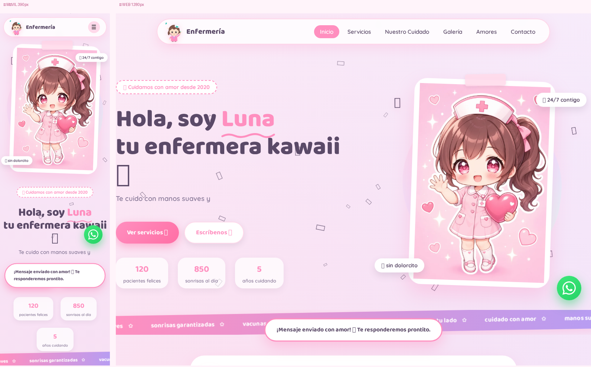

# Enfermería 🩵 — Web kawaii animada

> 💗 Una página de presentación para un servicio de enfermería pediatría, con diseño kawaii, animaciones suaves y acabado de producto real.

## 👀 Ver la web en vivo

[**➡️ ABRIR EL PROYECTO PUBLICADO AQUÍ**](https://iDreyK-ii.github.io/respaldo-kawaii/)



*La web funciona completa en cualquier dispositivo: teléfono, tablet y escritorio.*

---

## ✨ Qué incluye

| Sección | Detalle |
|---------|---------|
| 🎀 Hero | Animación de entrada, enfermera Lunita flotando (SVG animado), chips kawaii y cinta de frases en loop infinito |
| 👧 Lunita, la enfermera | Personaje SVG propio con parpadeo, sonrisa y parpadeo de ojos, más su tarjeta de presentación |
| 🎲 Servicios / "Nuestro kit" | Tarjetas con imágenes WebP, lazy-loading y animación al hacer scroll |
| 📸 Galería | Rejilla de fotos con zoom suave al pasar el cursor |
| 📋 Pasos | "¿Cómo es una cita?" en 3 pasos numerados |
| 📞 Contacto | Formulario con validación + toast de confirmación animado, datos de contacto y link directo a WhatsApp |
| 🎈 Extras | Botón "volver arriba" con globo, easter egg (clic en el logo = lluvia de corazones), contadores animados, barra de navegación con sección activa |

## 🚀 Características técnicas

- **PWA instalable** 📲 — `manifest.webmanifest` + *service worker* con caché offline (stale-while-revalidate). En el móvil se puede "instalar" como app.
- **Imágenes WebP** con fallback a PNG (reducción de ~95% en peso) y `loading="lazy"`.
- **Diseño responsivo** verificado en 7 viewports: 320×568, 360×640, 390×844, 768×1024, 1024×768, 1280×800 y 1440×900.
- **Accesible**: navegación por teclado con `:focus-visible`, `aria-live` en el toast, labels vinculados, `reduced-motion` respetado.
- **Rendimiento**: HTML/CSS/JS puros, sin frameworks ni build — abre al instante en cualquier hosting estático.
- **Mobile-first + safe-area** para teléfonos con notch.

## 🧪 Estado de calidad

- **Suite funcional 15/15** ✅ (menú móvil, animaciones 25/25, contadores, imágenes, formulario→toast, easter egg, botón subir, nav activa, link WhatsApp, 0 errores JS en móvil y escritorio)
- **Auditoría de layout: 0 problemas** ✅ en los 7 viewports (sin overflow horizontal, sin elementos fuera de su sitio, sin textos desbordados)

## 🖥️ Correrlo en local

```bash
# Opción 1: abrir el archivo directamente
open index.html

# Opción 2: servidor local
python3 -m http.server 8000
# → http://localhost:8000
```

## 🌐 Despliegue

Publicada con **GitHub Pages**:

- 🔗 **Enlace vivo:** [https://iDreyK-ii.github.io/respaldo-kawaii/](https://iDreyK-ii.github.io/respaldo-kawaii/)
- Cada `push` a `main` actualiza la web automáticamente en ~1 minuto.

## 📁 Estructura

```
├── index.html               # la web completa (HTML + CSS + JS)
├── manifest.webmanifest     # PWA (nombre, iconos, colores)
├── sw.js                    # service worker (caché offline)
├── assets/                  # imágenes WebP + iconos
│   ├── mascota.webp / kit.webp / fonendoscopio.webp
│   ├── utensilios.webp / pacientes.webp
│   └── icon-*.png           # iconos PWA y favicon
├── auditoria_final.png      # evidencia: móvil + web
└── comparacion.png          # antes/después del fix Android
```

## 📝 Nota

El número de WhatsApp es un **placeholder** (`51987654321`). Para poner el número real, editar el `href` de la clase `.wasap` en `index.html` (formato: `https://wa.me/51XXXXXXXXX`).

---

Hecho con 💗 por **Enfermería 🩵**
